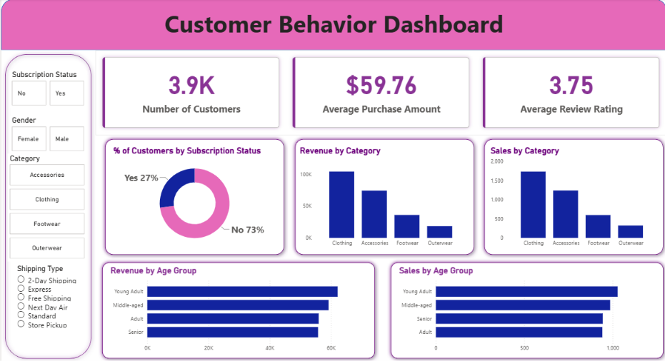

# 📊 Customer Shopping Behavior Analysis

An end-to-end **Customer Shopping Behavior Analysis** project that uses **Python, PostgreSQL, SQL, and Power BI** to analyze customer purchasing patterns, spending behavior, product performance, subscriptions, shipping preferences, and customer segments.

The project analyzes **3,900 customer purchase records** and converts raw transactional data into actionable business insights through SQL analysis and an interactive Power BI dashboard.

---

## 🚀 Project Overview

Understanding customer behavior is essential for improving customer retention, increasing revenue, optimizing marketing campaigns, and identifying high-value customer segments.

This project follows a complete data analytics workflow:

**Raw Dataset → Python Data Preparation → PostgreSQL → SQL Analysis → Power BI Dashboard → Business Insights**

The analysis focuses on questions such as:

* Do male or female customers generate more revenue?
* Do customers using discounts still make high-value purchases?
* Which products receive the highest ratings?
* Do Express Shipping customers spend more than Standard Shipping customers?
* Do subscribed customers spend more?
* Which products have the highest discount rates?
* How can customers be segmented based on purchase history?
* What are the most purchased products within each category?
* Are repeat buyers more likely to subscribe?
* Which age groups contribute the most revenue?

---

## 🛠️ Tech Stack

| Technology              | Purpose                                   |
| ----------------------- | ----------------------------------------- |
| 🐍 **Python**           | Data loading, exploration & preprocessing |
| 🐼 **Pandas**           | Data manipulation and analysis            |
| 🐘 **PostgreSQL**       | Database storage and SQL analysis         |
| 💻 **SQL**              | Business-oriented analytical queries      |
| 📊 **Power BI**         | Interactive dashboard & visualization     |
| 📓 **Jupyter Notebook** | Data exploration and preparation          |

---

## 📂 Project Workflow

### 1. Data Loading

The dataset was initially imported and explored using **Pandas**.

### 2. Exploratory Data Analysis

Initial exploration was performed to understand:

* Dataset structure
* Data types
* Summary statistics
* Customer demographics
* Purchase behavior
* Missing values

### 3. Data Cleaning

The dataset contained missing values in the **Review Rating** column. These values were handled using **median imputation**.

### 4. Feature Engineering

Additional analytical features were created, including:

* Age Groups
* Purchase Frequency
* Customer Segments

### 5. PostgreSQL Integration

The cleaned dataset was integrated with **PostgreSQL** for structured data analysis and business-focused SQL queries.

### 6. SQL Analysis

Multiple SQL queries were developed to answer key business questions involving:

* Revenue
* Customer spending
* Product ratings
* Shipping
* Subscriptions
* Discounts
* Customer segmentation
* Product popularity
* Age-group revenue

For example, revenue by gender is calculated using aggregation and grouping:

```sql
SELECT gender,
       SUM(purchase_amount) AS revenue
FROM customer
GROUP BY gender;
```

Additional queries are included in the repository's SQL file.

### 7. Power BI Dashboard

The analyzed data was connected to Power BI to create an interactive **Customer Behavior Dashboard**.

---

# 📊 Power BI Dashboard

The dashboard provides a high-level view of customer behavior and purchasing patterns.

### Key KPIs

* **3.9K** — Number of Customers
* **$59.76** — Average Purchase Amount
* **3.75** — Average Review Rating

### Dashboard Visualizations

The dashboard includes:

* Subscription Status
* Gender
* Product Category
* Shipping Type
* Revenue by Category
* Sales by Category
* Revenue by Age Group
* Sales by Age Group
* Subscription distribution

### Interactive Filters

Users can filter the dashboard based on:

* Subscription Status
* Gender
* Category
* Shipping Type

---

## 📈 Key Business Insights

### 👥 Gender Revenue

Female customers generate **slightly higher total revenue than male customers**, indicating that gender-based marketing strategies could potentially be used to optimize revenue streams.

### 💰 High-Value Discount Customers

The analysis identifies customers who:

* Used discounts
* Still spent above the average purchase amount

These customers represent potential **high-value shoppers** who actively seek discounts while maintaining higher spending levels.

### ⭐ Product Ratings

The analysis identifies highly rated products, with products such as **Blouse, Dress, and Shirt** appearing among the top-rated products.

### 🚚 Shipping Behavior

Customers using **Express Shipping** have a higher average purchase amount compared with Standard Shipping:

| Shipping Type | Average Purchase |
| ------------- | ---------------: |
| Express       |              $65 |
| Standard      |              $58 |

Express Shipping customers spend approximately **12% more per transaction**.

### 🔔 Subscription Impact

The analysis highlights a strong relationship between subscription status and customer spending/loyalty, with subscribers showing higher spending and contributing significantly to revenue.

### 👤 Customer Segmentation

Customers were segmented based on their previous purchase behavior:

| Segment      | Share |
| ------------ | ----: |
| 🆕 New       |   50% |
| 🔄 Returning |   35% |
| ⭐ Loyal      |   15% |

A key business opportunity is to **convert New customers into Returning customers and Returning customers into Loyal customers**.

---

# 🔍 SQL Analysis

The project contains **10 business questions** solved using PostgreSQL.

### Q1 — Revenue by Gender

Compare total revenue generated by male and female customers.

### Q2 — High-Value Discount Users

Identify customers who used a discount but spent at or above the average purchase amount.

### Q3 — Top-Rated Products

Find the five products with the highest average review rating.

### Q4 — Shipping Comparison

Compare average purchase amounts between Standard and Express Shipping.

### Q5 — Subscription Impact

Compare customer count, average spending, and total revenue between subscribers and non-subscribers.

### Q6 — Discount Rate by Product

Identify the five products with the highest percentage of purchases made using discounts.

### Q7 — Customer Segmentation

Segment customers into:

* New
* Returning
* Loyal

based on previous purchases.

### Q8 — Top Products by Category

Find the top three most purchased products within each product category using window functions.

### Q9 — Repeat Buyers & Subscription

Analyze whether customers with more than five previous purchases are more likely to subscribe.

### Q10 — Revenue by Age Group

Calculate the total revenue contribution of each age group.

## The complete SQL implementation is available in the repository.

# 💡 Business Recommendations

Based on the analysis, the following strategies can be considered:

### 1. 🔔 Boost Subscriptions

Promote exclusive benefits and incentives to encourage customers to subscribe.

### 2. ⭐ Strengthen Loyalty Programs

Reward repeat customers to improve retention and increase customer lifetime value.

### 3. 🎯 Targeted Marketing

Focus marketing campaigns on high-revenue customer segments and customers showing higher spending behavior.

### 4. 🚚 Promote Express Shipping

Since Express Shipping customers demonstrate higher average spending, premium shipping options can be positioned as part of a premium shopping experience.

### 5. 🛍️ Product Positioning

Highlight highly rated products in marketing campaigns and promotional content.

These recommendations align with the project's strategic findings.

---

# 📁 Repository Structure

```text
Customer-Shopping-Behavior-Analysis/
│
├── 📊 customer_behavior_dashboard.pbix
│      └── Power BI interactive dashboard
│
├── 🗄️ customer_behavior_sql_queries.sql
│      └── PostgreSQL business analysis queries
│
├── 📑 Customer-Shopping-Behavior-Analysis.pptx
│      └── Project presentation
│
├── 🖼️ dashboard.png
│      └── Power BI dashboard preview
│
└── 📄 README.md
       └── Project documentation
```

---

# 📊 Dashboard Preview



> The Power BI dashboard provides interactive filtering and visual analysis of customer demographics, subscriptions, categories, shipping preferences, revenue, and sales.

---

# 🎯 Skills Demonstrated

This project demonstrates practical skills in:

* Data Cleaning
* Exploratory Data Analysis
* Data Transformation
* Feature Engineering
* SQL
* PostgreSQL
* Aggregations
* Subqueries
* Common Table Expressions (CTEs)
* Window Functions
* Customer Segmentation
* Business Analytics
* Data Visualization
* Power BI Dashboard Development
* Business Insight Generation

---

# 📌 Conclusion

This project demonstrates an end-to-end **Data Analytics workflow**, starting from raw customer transaction data and progressing through data preparation, PostgreSQL-based SQL analysis, and interactive Power BI visualization.

The final dashboard transforms **3,900 purchase records** into actionable insights around customer spending, product performance, subscriptions, shipping behavior, and customer loyalty.

The project highlights how **SQL + Python + PostgreSQL + Power BI** can be combined to turn raw transactional data into meaningful business decisions.

---

## 👨‍💻 Author

**Aditya Santosh Bhosale**

B.E. Computer Science & Engineering (AI & ML)

Interested in **Data Analytics, Machine Learning, Generative AI, and AI Engineering**.

---

⭐ If you found this project useful, consider giving the repository a **star**!
